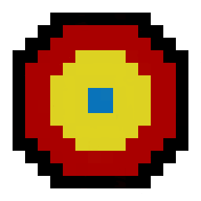
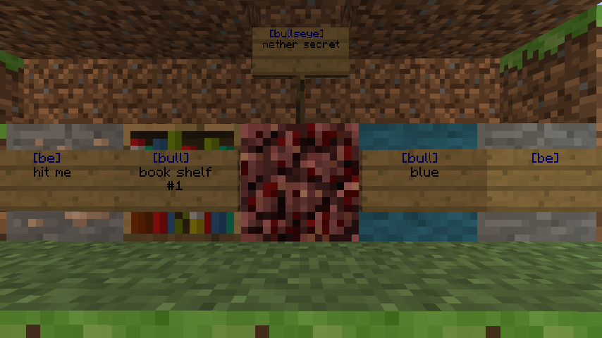
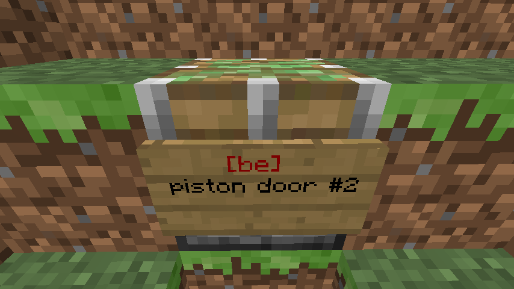

# Bullseye

Bullseye adds the ability for blocks to detect arrows with a sign. Allows you to create a Bullseye block (arrow detector block) by placing a sign, with special text, on any block. Whenever that block is hit with arrows, the sign will change to a redstone torch briefly.

This is different from a [Target block](https://minecraft.fandom.com/wiki/Target) because you can choose exactly which side the redstone torch will appear and you can make it _completely hidden_ by having the torch appear on the back of the block.

## Features

- Make blocks able to detect arrows hitting them!!
- The detection is shown by Bullseye signs turning into a redstone torch briefly
- No commands
- Can put multiple signs on one block
- Bullseye signs turn Blue if placed on a valid block, and Red if placed on an invalid block.
- Can configure which blocks to allow in an allow/deny list.
- Optional message to be displayed when the Bullseye block is hit with an arrow, message can be written on the last three lines.
    - Spaces needed between lines
    - Works with colors
- Works with any block you can put a sign on!
    - If the block has an Inventory (Chest, Dispenser, Enchantment Table, etc.) hold Shift to put a sign on them
- If the redstone torch breaks for any reason, it will drop the original sign instead of the torch
- Option for arrows shot out of Dispensers to activate the signs
- Option for arrows shot by Skeletons to activate the signs

## Usage

1. Make a sign and put the text `[bullseys]`, `[bull]`, or `[be]` on the first line
2. Optionally any text on the next 3 lines will be sent to you when you activate the sign
3. Now whenever you shoot the block the sign is on with an arrow, the sign will briefly turn into a redstone torch
   - Note: you don't have to hit the sign, just the block the sign is attached to
   - You can have multiple signs per block

These are examples of **valid** signs:

Here is an example of an **invalid** sign:

## To-Do

- Add permissions
- Customize per sign how long the redstone torch is active
- ~~Maybe figure out how to get Chests and Enchanting tables to work correctly??~~ (v0.8)
- ~~Add config for which blocks to allow~~ (v0.7)
- ~~Fix water issue~~ (v0.5)
- ~~Add Furnaces, Crafting tables, etc.~~ (v0.3)

Have more ideas? Create a ticket! :)
